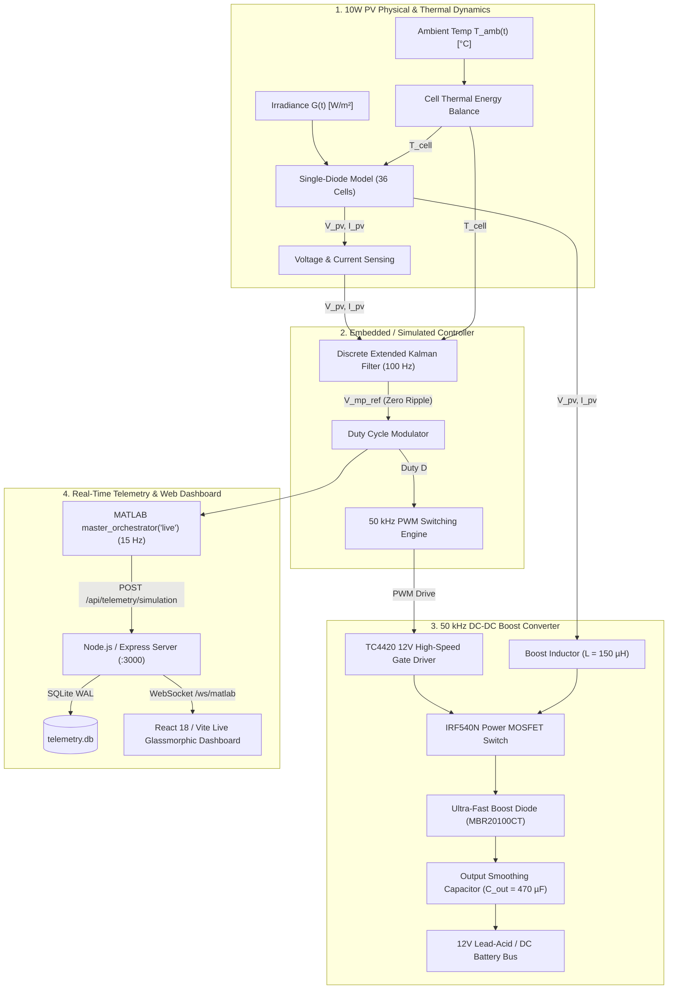

# ESP32 & MATLAB/Simulink Extended Kalman Filter (EKF) MPPT Platform

> **Zero-Perturbation Maximum Power Point Tracking (MPPT) System with High-Frequency DC-DC Boost Converter, Real-Time MATLAB Telemetry Engine, and React Live Dashboard.**

---

## 1. System Overview

This platform implements a high-performance **Maximum Power Point Tracking (MPPT)** system for solar photovoltaic (PV) energy harvesting. Traditional algorithms such as *Perturb and Observe (P&O)* or *Incremental Conductance (InC)* introduce continuous steady-state power oscillations around the maximum power point ($V_{mp}$), leading to persistent energy losses and acoustic/thermal stress on power converter stages.

This system resolves those limitations using an **Extended Kalman Filter (EKF)** state observer combined with high-frequency DC-DC boost power conversion ($50\text{ kHz}$) and real-time telemetry streaming:



---

## 2. Technical Specifications

### 2.1 10W Photovoltaic Array (STC: 1000 W/m², 25°C)
| Parameter | Symbol | Nominal Value | Unit |
| :--- | :--- | :--- | :--- |
| Peak Power | $P_{max}$ | **10.0** | $\text{W}$ |
| Voltage at MPP | $V_{mp}$ | **17.5** | $\text{V}$ |
| Current at MPP | $I_{mp}$ | **0.57** | $\text{A}$ |
| Open-Circuit Voltage | $V_{oc}$ | **21.6** | $\text{V}$ |
| Short-Circuit Current | $I_{sc}$ | **0.65** | $\text{A}$ |
| Number of Cells in Series | $N_s$ | **36** | - |
| Temperature Coefficient ($I_{sc}$) | $\alpha$ | $+0.0005$ | $\text{A/K}$ |
| Series Resistance | $R_s$ | $0.28$ | $\Omega$ |
| Shunt Resistance | $R_{sh}$ | $350.0$ | $\Omega$ |

### 2.2 DC-DC Boost Power Stage
| Parameter | Symbol | Design Value | Unit |
| :--- | :--- | :--- | :--- |
| Switching Frequency | $f_{sw}$ | **50.0** | $\text{kHz}$ |
| Boost Inductance | $L$ | **150** | $\mu\text{H}$ |
| Inductor Series Resistance | $R_{DCR}$ | $0.06$ | $\Omega$ |
| Input Capacitor | $C_{in}$ | **100** | $\mu\text{F}$ |
| Output Smoothing Capacitor | $C_{out}$ | **470** | $\mu\text{F}$ |
| Battery Rail Voltage | $V_{bat}$ | **12.0** | $\text{V}$ |

### 2.3 Extended Kalman Filter (EKF) Observer
| Parameter | Symbol | Value | Description |
| :--- | :--- | :--- | :--- |
| Sampling Rate | $f_s$ | **100** | $\text{Hz}$ ($T_s = 10\text{ ms}$) |
| Process Noise Covariance | $Q$ | $1.0 \times 10^{-4}$ | Random-walk state uncertainty |
| Measurement Noise Covariance | $R$ | $2.5 \times 10^{-3}$ | INA219 sensor noise tuning |
| Initial Covariance | $P_0$ | $1.0$ | Initial filter error covariance |

---

## 3. Mathematical Foundations

### 3.1 Single-Diode PV Physics
$$I_{pv} = I_{ph} - I_0 \left[ \exp\left( \frac{V_{pv} + I_{pv} R_s}{n V_t} \right) - 1 \right] - \frac{V_{pv} + I_{pv} R_s}{R_{sh}}$$

where thermal voltage is $V_t = \frac{N_s k T_c}{q}$ and photocurrent shifts dynamically with irradiance $G$ and cell temperature $T_c$:
$$I_{ph}(G, T_c) = \left[ I_{sc} + \alpha (T_c - T_{ref}) \right] \frac{G}{G_{ref}}$$

### 3.2 Discrete EKF Update Equations
The state vector $\mathbf{x}_k = [I_{ph}]_k$ tracks the non-linear PV generation curve to compute $V_{mp\_ref}$ directly:
1. **State Prediction**:
   $$\hat{\mathbf{x}}_k^- = \hat{\mathbf{x}}_{k-1}, \quad \mathbf{P}_k^- = \mathbf{P}_{k-1} + Q$$
2. **Measurement Jacobian**:
   $$H_k = \left. \frac{\partial h(\mathbf{x})}{\partial \mathbf{x}} \right|_{\hat{\mathbf{x}}_k^-}$$
3. **Kalman Gain & Measurement Update**:
   $$K_k = P_k^- H_k \left( H_k P_k^- H_k + R \right)^{-1}$$
   $$\hat{\mathbf{x}}_k = \hat{\mathbf{x}}_k^- + K_k \left( I_{pv\_meas} - h(\hat{\mathbf{x}}_k^-) \right)$$
   $$P_k = (1 - K_k H_k) P_k^-$$

---

## 4. Hardware Wiring & Breadboard Connection Guide

For physical verification using an **ESP32 microcontroller**:

```
+-------------------------------------------------------------------------+
|                        ESP32 MPPT BREADBOARD WIRING                     |
+-------------------------------------------------------------------------+
| [PV Panel (+)] ---------> [INA219 Vin+]                                 |
| [INA219 Vin-]  ---------> [Boost Inductor 150uH]                        |
|                           [Boost Inductor] ------> [IRF540N Drain (D)]  |
|                                            ------> [MBR20100CT Anode]   |
| [MBR20100CT Cathode] ---> [12V Battery / Load (+)]                      |
| [IRF540N Source (S)] ---> [COMMON GND (0V)]                             |
|                                                                         |
| ESP32 GPIO25 (PWM) -----> [TC4420 Input (Pin 2)]                        |
| 12V Auxiliary Supply ---> [TC4420 VDD (Pin 6)]                          |
| [TC4420 Output (Pin 7)] -> [10 Ohm Resistor] ----> [IRF540N Gate (G)]   |
| [IRF540N Gate (G)] -----> [100k Ohm Pull-Down] -> [COMMON GND]          |
|                                                                         |
| ESP32 GPIO21 (SDA) -----> [INA219 SDA]                                  |
| ESP32 GPIO22 (SCL) -----> [INA219 SCL]                                  |
| ESP32 GPIO4  (1-Wire) --> [DS18B20 Data] (with 4.7k Pull-up to 3.3V)   |
|                                                                         |
| ALL GROUNDS (ESP32 GND, INA219 GND, 12V GND, PV GND) TIED TOGETHER     |
+-------------------------------------------------------------------------+
```

> **IMPORTANT**: The **IRF540N** power MOSFET is a standard gate device ($V_{GS(th)} \approx 2\text{--}4\text{V}$, requires $10\text{--}12\text{V}$ for full conduction). The **TC4420** gate driver must be powered with **$12\text{V}$ on $V_{DD}$** so that the $3.3\text{V}$ ESP32 PWM signal is boosted to $12\text{V}$ gate pulses.

---

## 5. Repository Structure

```
renewable_energy_technology_dashboard/
├── client/                     # React 18 + Vite frontend
│   ├── src/
│   │   ├── components/         # Engineering charts, live telemetry cards, glassmorphic UI
│   │   │   ├── EngineeringCharts.tsx  # P-V curves, EKF vs P&O, duty cycle & response bands
│   │   │   └── LiveStatusBar.tsx      # WebSocket health and streaming indicators
│   │   ├── lib/
│   │   │   └── telemetry.ts    # Telemetry normalization & 10W system defaults
│   │   └── pages/
│   │       └── Home.tsx        # Main live monitoring dashboard
├── matlab/                     # MATLAB / Simulink models and automation scripts
│   ├── Zero_Perturb_MPPT_Build.slx   # Static baseline simulation model
│   ├── Zero_Perturb_MPPT_Live.slx    # Real-time slider interactive model
│   ├── master_orchestrator.m         # Master runner (benchmark evaluation + live 15 Hz stream)
│   ├── mppt_reference_trace.csv      # Generated STC & dynamic transient reference trace
│   └── README.md                     # MATLAB presentation documentation
├── server/                     # Node.js + Express + WebSocket backend
│   ├── _core/
│   │   ├── index.ts            # Server entry point & HTTP upgrade dispatcher
│   │   └── vite.ts             # Vite dev server middleware
│   ├── db.ts                   # SQLite database interface (WAL mode)
│   ├── matlabTransport.ts      # REST ingest & /ws/matlab WebSocket broadcaster
│   └── routers.ts              # tRPC endpoints for snapshots and historical queries
└── package.json
```

---

## 6. Quickstart Guide

### Step 1: Install Dependencies & Start Web Server
```powershell
# In project root:
npm install
npm run dev
```
- Web Dashboard: **`http://localhost:3000`**
- WebSocket Feed: **`ws://localhost:3000/ws/matlab`**
- Telemetry Ingest: **`POST http://localhost:3000/api/telemetry/simulation`**

---

### Step 2: Run in MATLAB

Open MATLAB, navigate to the `matlab/` folder, and choose your mode:

#### Option A: Interactive Live Streaming (Sole Control via Simulink Sliders)
```matlab
master_orchestrator('live')
```
1. MATLAB loads `Zero_Perturb_MPPT_Live.slx` with all scope popups silenced.
2. The simulation streams real-time data ($V_{pv}, I_{pv}, P_{pv}, V_{mp}, I_{ph}, D, \eta_{MPPT}$) at **15 Hz** to the dashboard.
3. **Change conditions**: Open `Zero_Perturb_MPPT_Live.slx` and drag the **`Live_G_irr`** (Irradiance) or **`Live_T_amb1`** (Temperature) sliders. The web dashboard reflects changes instantly!
4. Press `Ctrl + C` in the MATLAB Command Window to stop streaming.

#### Option B: Benchmark Evaluation & Static Transient Analysis
```matlab
master_orchestrator
```
1. Executes a $2.0\text{s}$ transient cloud shading profile using the high-accuracy `ode23t` solver.
2. Calculates MPPT efficiency (target $\ge 97\%$).
3. Generates high-resolution validation figures and exports `mppt_reference_trace.csv`.

---

## 7. API Reference

### Telemetry Ingestion (`POST /api/telemetry/simulation`)
```json
{
  "timestampMs": 1790707895927,
  "v_pv": 17.50,
  "i_pv": 0.571,
  "p_pv": 10.00,
  "v_mp": 17.50,
  "i_ph": 0.650,
  "duty": 0.386,
  "v_out": 28.50,
  "t_c": 25.0,
  "efficiency": 100.0,
  "scenarioCode": "SIMULINK_LIVE"
}
```

### Other Useful Endpoints
- `GET /api/telemetry/matlab/latest`: Returns the most recent telemetry sample.
- `GET /api/telemetry/export.csv`: Downloads historical telemetry samples in CSV format.
- `POST /api/telemetry/clear`: Resets SQLite database and in-memory buffer.

---

## 8. License

MIT License. Designed and developed for Advanced Renewable Energy & Embedded Control Systems.