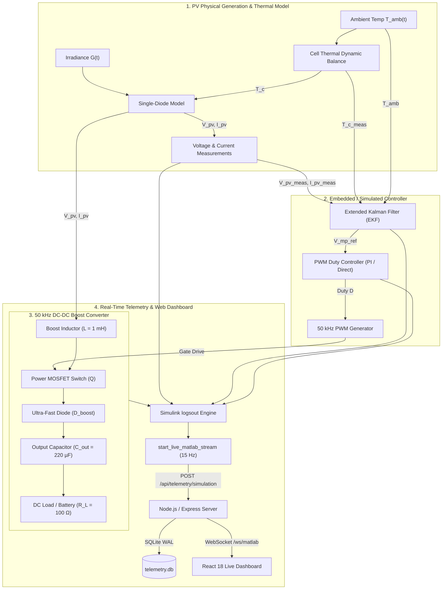

# ESP32 & MATLAB/Simulink Extended Kalman Filter (EKF) MPPT Control Platform
## Master Technical Documentation & Presentation Guide

---

## 1. System Overview & Architecture

This project implements an end-to-end solar Photovoltaic (PV) Maximum Power Point Tracking (MPPT) system integrating:
* **Physics-Based PV Model**: 5-Parameter single-diode circuit with dynamic thermal energy balance in MATLAB/Simulink (`ekf.slx`).
* **Stochastic State Estimation**: Extended Kalman Filter (EKF) algorithm estimating photocurrent ($I_{ph}$), cell temperature ($T_c$), and maximum power voltage ($V_{mp\_ref}$) with zero hunting ripple.
* **Power Electronics**: $50\text{ kHz}$ DC-DC Boost Converter operating in Continuous Conduction Mode (CCM).
* **Live Telemetry Engine**: Incremental chunked execution in MATLAB streaming directly over HTTP REST & WebSockets into a modern React/TypeScript dashboard with SQLite data persistence.



---

## 2. Mathematical Equations & Physical Modeling

### 2.1 Photovoltaic Single-Diode Model
$$I_{pv} = I_{ph} - I_0 \left[ \exp\left( \frac{V_{pv} + I_{pv} R_s}{n V_t} \right) - 1 \right] - \frac{V_{pv} + I_{pv} R_s}{R_{sh}}$$

* $V_t = \frac{N_s k T_c}{q}$: Thermal voltage ($\text{V}$)
* $I_{ph}(G, T_c) = [I_{sc,STC} + K_i(T_c - T_{ref})] \frac{G}{G_{ref}}$
* $I_0(T_c) = I_{0,STC} \left(\frac{T_c}{T_{ref}}\right)^3 \exp\left[\frac{q E_g}{n k} \left(\frac{1}{T_{ref}} - \frac{1}{T_c}\right)\right]$

### 2.2 Extended Kalman Filter State Estimation
State vector $\mathbf{x} = [V_{mp\_ref}, I_{ph\_est}, T_{c\_est}]^T$ and measurement $y = I_{pv\_meas}$.

1. **Prediction (Time Update)**:
   $$\hat{\mathbf{x}}_k^- = \hat{\mathbf{x}}_{k-1}, \quad \mathbf{P}_k^- = \mathbf{P}_{k-1} + \mathbf{Q}$$
2. **Correction (Measurement Update)**:
   $$\mathbf{H}_k = \left.\frac{\partial h}{\partial \mathbf{x}}\right|_{\hat{\mathbf{x}}_k^-}$$
   $$\mathbf{K}_k = \mathbf{P}_k^- \mathbf{H}_k^T (\mathbf{H}_k \mathbf{P}_k^- \mathbf{H}_k^T + R)^{-1}$$
   $$\hat{\mathbf{x}}_k = \hat{\mathbf{x}}_k^- + \mathbf{K}_k (I_{pv\_meas} - h(\hat{\mathbf{x}}_k^-))$$
   $$\mathbf{P}_k = (\mathbf{I} - \mathbf{K}_k \mathbf{H}_k) \mathbf{P}_k^-$$

### 2.3 50 kHz DC-DC Boost Converter (CCM)
* **Voltage Ratio**: $V_{out} = \frac{V_{pv}}{1 - D}$
* **Current Ratio**: $I_{out} = I_{pv} \cdot (1 - D)$
* **Impedance Matching**: $R_{in,apparent} = R_L (1 - D)^2 \implies D^* = 1 - \sqrt{\frac{V_{mp} / I_{mp}}{R_L}}$

---

## 3. Directory Structure & File Index

| File | Description |
| :--- | :--- |
| [`start_live_matlab_stream.m`](file:///c:/Users/saisi/.antigravity-ide/renewable_energy_technology_dashboard/matlab/start_live_matlab_stream.m) | Main live streaming function executing Simulink chunk-by-chunk and streaming to web dashboard at $15\text{ Hz}$. |
| [`stop_live_matlab_stream.m`](file:///c:/Users/saisi/.antigravity-ide/renewable_energy_technology_dashboard/matlab/stop_live_matlab_stream.m) | Cleanly terminates active live simulation streams. |
| [`ekf.slx`](file:///c:/Users/saisi/.antigravity-ide/renewable_energy_technology_dashboard/matlab/ekf.slx) | Complete Simulink Simscape model with PV panel, EKF block, and $50\text{ kHz}$ boost circuit. |
| [`benchmark_ekf.m`](file:///c:/Users/saisi/.antigravity-ide/renewable_energy_technology_dashboard/matlab/benchmark_ekf.m) | Quantitative comparison script: EKF vs. P&O vs. Incremental Conductance. |
| [`plot_mppt_comparison.m`](file:///c:/Users/saisi/.antigravity-ide/renewable_energy_technology_dashboard/matlab/plot_mppt_comparison.m) | Multi-panel dark-theme comparison figure in MATLAB. |
| [`fetch_telemetry_from_web.m`](file:///c:/Users/saisi/.antigravity-ide/renewable_energy_technology_dashboard/matlab/fetch_telemetry_from_web.m) | Queries logged SQLite telemetry samples from Node API into a MATLAB `table`. |

---

## 4. How to Run the Platform

### Step 1: Launch Web Backend & Dashboard
In the project root directory:
```bash
npm run dev
```
* **Dashboard URL**: `http://localhost:3000`
* **API Health Check**: `http://localhost:3000/api/health`

### Step 2: Start Live Simulation in MATLAB
In your **MATLAB Command Window**:
```matlab
% Add project folder to MATLAB path
addpath('c:\Users\saisi\.antigravity-ide\renewable_energy_technology_dashboard\matlab');

% Start live telemetry stream
start_live_matlab_stream
```

### Step 3: Stop Streaming Anytime
```matlab
stop_live_matlab_stream
```
*(or press `Ctrl + C` in the MATLAB Command Window)*.
